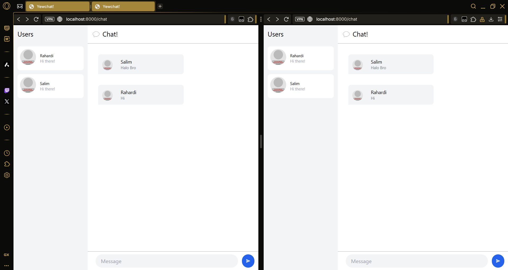
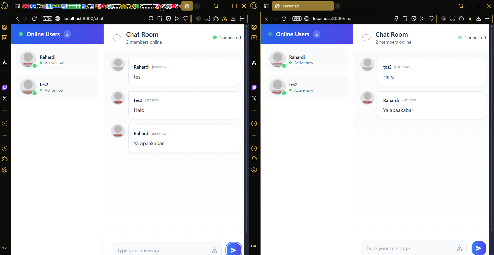

## 1.1

We are now transitioning from a console-based chat system to a browser-based chat experience using WebSockets, Rust, and the Yew framework. This modern approach allows real-time messaging over the web, making it more accessible and user-friendly.

In this experiment, we focused on the client-side implementation of the webchat system. The code was cloned from the DevGenius blog tutorial, which provided a great starting point. After successfully cloning and running both the client and server projects, we tested the application locally.

The image below demonstrates two browser windows connected to localhost:8000/chat. As seen, both users ("Rahardi" and "Salim") can send and receive messages in real time, and the interface displays all connected users and their messages.

This test confirms the original code runs successfully and supports real-time chat between multiple users via a graphical web interface.

## 1.2

Compared to the previous implementation, this update includes:

- **Online Users List:**  
  - Users are now dynamically listed in the sidebar with avatars and online status.
  - Each avatar is generated using [DiceBear Avatars](https://avatars.dicebear.com/).
  - Updates are triggered via `MsgTypes::Users`.

- **Structured WebSocket Message Handling:**  
  - Introduced `WebSocketMessage` struct to differentiate between `Register`, `Users`, and `Message` types.
  - Enhanced serialization/deserialization with Serde enums (`MsgTypes`) and camelCase naming.

- **Message Display Improvements:**  
  - Messages now show avatars and timestamps ("just now").
  - Supports displaying `.gif` messages as inline images.

- **Component Cleanup & Reusability:**  
  - Abstracted message handling logic via `Msg::HandleMsg`.
  - Used Yew `Context` API to retrieve the current user.

- **Stylized UI:**  
  - Improved layout using TailwindCSS with modern UI patterns like hover effects, transitions, pulse animations, etc.
